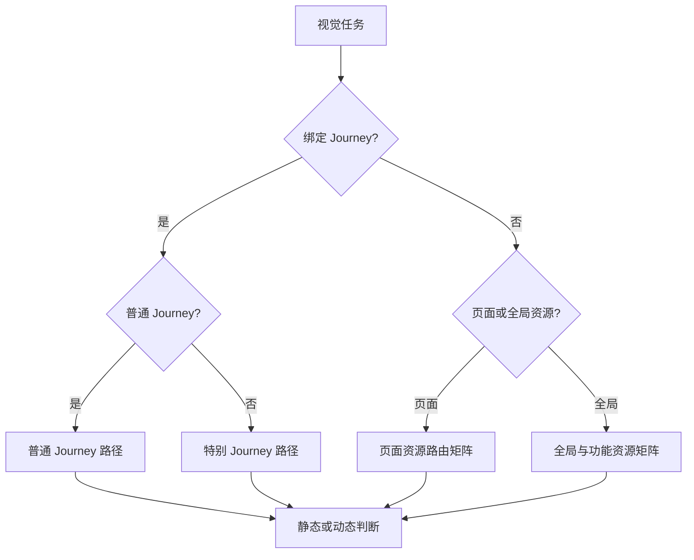

# Phoenix Visual Decision Tree

Documentation Status: Active
Documentation Version: 1.0.0
Priority: ★★★★★ (Mandatory Visual Routing Standard)
Owner: Phoenix Visual Architecture

---

# 1. Purpose

Phoenix Visual Decision Tree（简称 Visual Decision Tree）帮助未来 AI、设计者与开发者在制作任何视觉资源之前，根据资源类型、页面、Story、Journey、文化、设备、动态价值、版权与性能条件，选择唯一可执行的视觉方案和 Documentation 路径。

本文件负责：

- 识别视觉任务类型。
- 选择普通 Journey 或特别 Journey 路径。
- 决定静态、动态与具体技术形式。
- 路由人物、建筑、文化、安全区、AI Error、版权、设备与性能问题。
- 指定必须通过的 Gate、输出和失败回退。
- 阻止复杂技术、动画或 AI 生成反向决定 Story、Learning、UI 或 Audio。

本文件不负责：

- 生成视觉资产。
- 替代 `VISUAL_PIPELINE.md` 的生产阶段。
- 替代 `IMAGE_QUALITY_GATE`、`VISUAL_CHECKLIST` 或 `VISUAL_REVIEW_PROMPT`。
- 创造 Story、Learning、UI、Audio、Animation、Performance、QA 或 Release 规则。
- 因代码已经存在而批准某种视觉形式。
- 因方案“看起来高级”而绕过真实性、版权、设备、性能或页面级 QA。

Decision Tree 只选择路径。

Visual Pipeline 执行路径。

Quality Gate、Checklist、Review、页面级 QA 与 Release System 决定路径产物是否合格。

---

# 2. Authority and Reading Order

本文件必须在以下权威之后读取：

1. 当前用户明确指令与安全、法律、平台边界。
2. Repository README。
3. `docs/systems/README.md`。
4. `docs/systems/SYSTEM_ARCHITECTURE.md`。
5. `docs/systems/SYSTEM_DEPENDENCY.md`。
6. `docs/systems/SYSTEM_LIFECYCLE.md`。
7. `docs/systems/SYSTEM_PRIORITY.md`。
8. `docs/story/README.md`、Story Constitution、Story Philosophy 与 Approved Story Contract（适用时）。
9. `docs/visual/README.md`。
10. `docs/visual/VISUAL_CONSTITUTION.md`。
11. `docs/visual/VISUAL_PHILOSOPHY.md`。
12. `docs/visual/VISUAL_GUIDELINES.md`。
13. `docs/visual/BACKGROUND_GUIDELINES.md`（背景适用时）。
14. `docs/visual/AI_IMAGE_GENERATION_GUIDE.md`（AI 生成适用时）。
15. 本 `VISUAL_DECISION_TREE.md`。
16. `docs/visual/VISUAL_PIPELINE.md`。
17. `IMAGE_QUALITY_GATE`、`VISUAL_CHECKLIST` 与 `VISUAL_REVIEW_PROMPT`。

本 Decision Tree 高于 Pipeline 的路径选择，但低于 Constitution、Philosophy 与 Guidelines。它不得削弱 Pipeline 的任何强制 Stage 或 Gate。

若上游规范缺失、不可读、版本不适用或无法裁决冲突：

`BLOCKED → 停止视觉生成与导入 → 返回 Documentation Owner / 对应 System Owner`。

---

# 3. Decision Model

## 3.1 Node Format

每个决策节点使用：

| Field | Meaning |
| --- | --- |
| Node | 唯一节点编号 |
| Question | 必须由 Evidence 回答的问题 |
| YES → | 条件成立时的唯一下一路径 |
| NO → | 条件不成立时的唯一下一路径 |

每个节点固定包含两条 Decision Branch：YES 与 NO。

不得使用“可能”“大概”“先试试看”代替 YES/NO。

证据不足不是 NO。

证据不足的结果是 `BLOCKED` 或返回 Research。

## 3.2 Terminal Decisions

| Terminal | Meaning |
| --- | --- |
| `ROUTE_CONFIRMED` | 资源类型、规范与 Pipeline 起点已确定 |
| `STATIC_SELECTED` | 使用高清静态方案，并继续设备、性能和 Gate 流程 |
| `MOTION_ELIGIBLE` | 仅表示可以进入动态制作，不表示动态已经批准 |
| `REGENERATE` | 返回 Pipeline Stage 09–10 重新生成 Candidate |
| `LOCAL_REPAIR_AND_REVIEW` | 仅允许有限局部修复；修复后重新执行受影响 Review |
| `RECORD_AND_CONTINUE` | 轻微 Finding 已记录且不影响正式质量，可继续 Gate |
| `BLOCKED` | 缺少权威、事实、权利、设备、性能或必要 Evidence，禁止导入 |
| `REJECTED` | Candidate 或来源不可接受，终止当前 Candidate |
| `ELIGIBLE_FOR_PIPELINE` | 决策完成，可按选定路径进入 Visual Pipeline |
| `NOT_ELIGIBLE_FOR_RELEASE` | 未满足正式版条件，不得交给 Release |
| `ELIGIBLE_FOR_RELEASE` | 全部强制 Evidence PASS，可交给 Release System；不等于已发布 |

## 3.3 No Silent N/A

只有规范明确允许时才可使用 N/A。

N/A 必须记录：

- 不适用原因。
- 适用范围。
- 决策人。
- Candidate ID 与 Version。
- 不影响哪个 Gate 的依据。

---

# 4. Entry Classification Tree

入口节点：

| Node | Question | YES → | NO → |
| --- | --- | --- | --- |
| ENT01 | 当前请求是否确实需要新建、替换或实质修改视觉资源？ | ENT02 | `REJECTED → 不创建无需求视觉` |
| ENT02 | 目标 Branch、Commit、页面、范围和授权是否明确？ | ENT03 | `BLOCKED → Pipeline Stage 01 Requirement Confirmation` |
| ENT03 | 任务是否绑定 Journey？ | ENT04 | ENT06 |
| ENT04 | Journey 是否已由 Story System 明确分类？ | ENT05 | `BLOCKED → Story Decision Tree / Pipeline Stage 03` |
| ENT05 | 是否为普通 Journey？ | `ORD01` | `SPC01` |
| ENT06 | 是否绑定具体页面或组件？ | ENT07 | ENT08 |
| ENT07 | 页面类型是否存在于 Resource Routing Matrix？ | `使用对应 Route ID` | ENT08 |
| ENT08 | 是否为功能性视觉？ | `ROUTE-FUNCTIONAL` | ENT09 |
| ENT09 | 是否为装饰性视觉？ | `ROUTE-DECORATIVE` | ENT10 |
| ENT10 | 是否为其他 AI 原创视觉资源且用途、Owner 和 Consumer 可定义？ | `ROUTE-AI-OTHER` | `BLOCKED → Pipeline Stage 01` |

---

# 5. Resource Routing Matrix

所有 Route 均必须继续执行 `VISUAL_PIPELINE.md` Stage 01–25。表中的 Gate 是该类型的额外最低集合，不减少 Pipeline Gate。

| Route ID / Task type | 必须读取的规范 | 可选读取的规范 | 适用视觉形式 | 禁止使用的形式 | 必须通过的 Gate | 最终输出要求 |
| --- | --- | --- | --- | --- | --- | --- |
| `ROUTE-ORDINARY` 普通 Journey | Story Contract、Visual Constitution/Philosophy/Guidelines、Background Guidelines、Visual Pipeline | AI Image Guide、地图/页面相关规范 | 真实静态背景、可控分层背景、必要的轻动态 | 旅游海报、明信片、通用古城、仅换地标/颜色 | Culture、Journey、AI Error、Copyright、Device、Performance、Fallback、最终三 Gate、Page QA | 具有独立地方身份的 Master、设备变体、Metadata 与 Evidence |
| `ROUTE-SPECIAL` 特别 Journey | Story Contract、Story Constitution/Philosophy、Visual 全部现行规范、Pipeline | 原典研究、适用 Audio/Animation | 文学性静态构图、象征性画面、可控幻想、必要轻动态 | 网游、欧美奇幻、赛博、紫黑雾模板、廉价怪物/粒子 | Original Spirit、Culture、Journey、AI Error、Copyright、Motion、Device、Performance、Fallback、最终三 Gate、Page QA | 原典边界清楚、幻想合理、同类不重复的正式资源集 |
| `ROUTE-HOME` 首页视觉 | Visual Constitution/Philosophy/Guidelines、Pipeline、UI Contract | Brand、Performance、Accessibility | 高清静态、轻量程序化/分层效果 | 营销海报、强自动播放视频、复杂特效抢入口 | Safe Area、Accessibility、Performance、Fallback、最终三 Gate、Page QA | 品牌入口、导航和首屏加载均清楚的响应式资源 |
| `ROUTE-WORLD-MAP` 世界地图 | Visual Guidelines、Pipeline、UI/Geo Contract | Background、Animation、Performance | 地图插画、SVG/Canvas 节点层、轻量缩放/路径 | 地理错误、装饰遮挡节点、错误路径/落点 | Geography、Interaction、Device、Performance、Fallback、最终三 Gate、Page QA | 地理层级、节点、路径、缩放和静态回退一致 |
| `ROUTE-CITY-MAP` 城市地图 | Visual Guidelines、Pipeline、Journey/Geo Contract | Background、AI Image Guide | 可读地图插画、SVG/Canvas 热点层 | 虚构道路冒充真实布局、地标错位、过度装饰 | Culture/Geography、Interaction、Device、Performance、最终三 Gate、Page QA | 城市身份、热点、标签与导航 Evidence 完整 |
| `ROUTE-PASSPORT` 护照 | Visual Guidelines、Pipeline、Journey/Completion Contract | Background、Animation | 地图热点、Journey 缩略图、盖章视觉 | 左侧密集列表替代地图层级、装饰伪装按钮 | Journey、Safe Area、Interaction、Device、Motion/Fallback、最终三 Gate、Page QA | 旅程名、热点、状态和小盖章清楚且可操作 |
| `ROUTE-STORY-BG` 故事背景 | Story Contract、Visual 全部现行规范、Background、Pipeline | AI Image Guide、Audio | 静态或低权重分层背景 | 叙事海报、字幕式剧情、强人物焦点压过正文 | Story/Journey、Safe Area、AI Error、Culture、Copyright、Device、Performance、最终三 Gate、Page QA | 正文与朗读安全、Story Scene 一致的 Master 和变体 |
| `ROUTE-DYNAMIC-BG` 动态背景 | Visual Guidelines、Background、Pipeline、Accessibility/Performance Contract | Animation、AI Image Guide | 分层轻动效、视差、可控程序化或短循环 | 无静态回退、强镜头、闪烁、明显循环 | Motion Naturalness、Safe Area、Device、Performance、Reduced Motion、Fallback、最终三 Gate、Page QA | 动态、高清静态、Reduced Motion 与低性能版本成套 |
| `ROUTE-STATIC-BG` 静态背景 | Visual Guidelines、Background、Pipeline | AI Image Guide | 单张或分层高清静态 | 低清放大、壁纸化、自动中心裁切覆盖全部设备 | Composition、Safe Area、AI Error、Culture、Copyright、Device、Performance、最终三 Gate、Page QA | 高分辨率 Master、响应式裁切与 Metadata |
| `ROUTE-VOCABULARY` 生词页 | Visual Guidelines、Pipeline、Learning/UI/Audio Contract | Background | 低干扰静态、弱层次环境 | 抢夺单词/词性/翻译、卡片或朗读按钮的视觉 | Learning、Safe Area、Audio Control、Device、Performance、最终三 Gate、Page QA | 单词、词性、母语、英语与朗读控件始终清楚 |
| `ROUTE-DISCOVERY` 发现页 | Story/Discovery Contract、Visual Guidelines、Pipeline | Background、AI Image Guide、Audio | 文化相关静态/轻背景、辅助插画 | 复制 Story、百科海报、朗读控件后方动态 | Culture、Source、Safe Area、Audio、Device、Performance、最终三 Gate、Page QA | 发现内容、来源、朗读与探索操作安全 |
| `ROUTE-CHALLENGE` 挑战页 | Visual Guidelines、Pipeline、Learning/UI Contract | Background | 稳定静态、极低权重环境 | 暗示答案、选项后动态、视觉化奖惩压力 | Learning、Option Safety、Device、Performance、最终三 Gate、Page QA | 题目、至少五个选项、重试和完成状态清楚 |
| `ROUTE-MEMORY` 留下印象页 | Story Contract、Visual Guidelines、Pipeline、Memory Contract | Background、Animation | Story Memory Anchor 静态/轻视觉 | 把奖励或总结当 Story 结尾、通用纪念卡模板 | Story Version、Journey、Safe Area、Motion/Fallback、最终三 Gate、Page QA | 与同一 Story Version 对应的记忆视觉和状态资源 |
| `ROUTE-STAMP` 盖章页 | Visual Guidelines、Pipeline、Completion/UI Contract | Background、Animation | 盖章静态状态、短促可降级动画 | 用盖章代替文学结尾、无法停止或恢复的动画 | Completion、Motion、Reduced Motion、Fallback、Device、最终三 Gate、Page QA | 触发、完成、返回重进和静态状态一致 |
| `ROUTE-BANNER` Banner | Visual Guidelines、Pipeline、UI Contract | AI Image Guide、Brand | 横向插画、响应式图文留白 | 烧入不可适配文字、海报式多焦点 | Safe Area、Copyright、Device、Performance、最终三 Gate、Page QA | 横向 Master、窄宽变体、可读文案区域和 Metadata |
| `ROUTE-LOADING` Loading | Visual Guidelines、Pipeline、UI/Performance Contract | Animation、Accessibility | 轻量静态、程序化或短可降级动画 | 虚假进度、无限刺激循环、阻断重试 | Accessibility、Motion、Performance、Fallback、Page QA | 正常、慢速、失败、重试与静态状态完整 |
| `ROUTE-SPLASH` Splash | Visual Guidelines、Pipeline、Brand/Platform Contract | Animation、Performance | 高效静态或极轻启动动画 | 大视频、延迟启动、复杂 WebGL、强闪光 | Device、Accessibility、Performance、Fallback、Page QA | 启动快速、比例安全、品牌清楚的多 DPI 资源 |
| `ROUTE-UI-ILLUSTRATION` UI 插画 | Visual Guidelines、Pipeline、UI Contract | AI Image Guide | 状态插画、空状态、解释性插画 | 伪装控件、改变信息架构、无用途装饰 | UI Meaning、AI Error、Copyright、Device、Performance、Page QA | 语义、状态、尺寸、暗/亮环境与 Metadata 完整 |
| `ROUTE-ICON` Icon | Visual Guidelines、Pipeline、UI/Accessibility Contract | SVG/Brand Guideline | SVG 或可控矢量、必要透明位图 | AI 直接生成不可控小图、写实复杂图、颜色唯一表达 | Semantic、Accessibility、Device/DPI、Copyright、Performance、Page QA | 小尺寸可辨、光学对齐、状态成套的正式资产 |
| `ROUTE-DECORATIVE` 装饰性视觉 | Visual Constitution/Philosophy/Guidelines、Pipeline | Background、AI Image Guide | 低权重静态、可移除装饰 | 看似按钮、抢内容、无意义动画 | Reading、Interaction、Copyright、Performance、Page QA | 可移除而不损害理解，且不越过内容优先级 |
| `ROUTE-FUNCTIONAL` 功能性视觉 | Visual Guidelines、Pipeline、UI/Learning/Accessibility Contract | Animation、Performance | 状态、导航、反馈、进度或语义视觉 | 只美观不传达状态、只靠颜色、动画唯一反馈 | Semantic、Interaction、Accessibility、Device、Performance、Fallback、Page QA | 状态与行为语义明确，静态/辅助技术可理解 |
| `ROUTE-AI-OTHER` 其他 AI 原创视觉资源 | Visual Constitution/Philosophy/Guidelines、AI Image Guide、Pipeline | 与 Consumer 对应的专业规范 | 与明确用途相符的原创静态/动态资源 | 来源不明、用途不明、模仿与拼接 | AI Error、Culture（适用）、Copyright、Consumer、Device、Performance、Fallback、最终三 Gate、Page QA | Asset ID、Owner、Consumer、Source、Runtime Variant 与 Evidence 完整 |

---

# 6. Ordinary Journey Decision Path

普通 Journey 必须从真实地方、生活与 Story Contract 出发，不得从通用背景或现有模板出发。

| Node | Question | YES → | NO → |
| --- | --- | --- | --- |
| ORD01 | 城市或地区是否明确到可研究范围？ | ORD02 | `BLOCKED → Pipeline Stage 03` |
| ORD02 | 是否存在 Approved Story Contract 与稳定 Journey ID？ | ORD03 | `BLOCKED → Story Owner / Pipeline Stage 03` |
| ORD03 | 是否具有必须被识别的文化地标？ | ORD04 | ORD05 |
| ORD04 | 地标的名称、结构、位置、时代与视觉边界是否有可靠依据？ | ORD05 | `RETURN → Pipeline Stage 04 Cultural Research` |
| ORD05 | 是否需要真实地理依据或空间关系？ | ORD06 | ORD07 |
| ORD06 | 地理布局、方向、路径与环境关系是否可验证？ | ORD07 | `RETURN → Pipeline Stage 04` |
| ORD07 | 是否属于现实生活场景？ | ORD08 | `RETURN → Story Owner 确认是否误分类为特别 Journey` |
| ORD08 | Story 是否要求人物存在？ | `PPL01`，完成后回到 ORD09 | ORD09 |
| ORD09 | Story 是否要求城市建筑？ | `ARC01`，完成后回到 ORD10 | ORD10 |
| ORD10 | Story 是否要求自然环境？ | ORD11 | ORD12 |
| ORD11 | 植物、地貌、季节、天气与时间是否符合地区？ | ORD12 | `RETURN → Pipeline Stage 04` |
| ORD12 | 是否提出动态背景？ | `MOT01`，完成后回到 ORD13 | ORD13 |
| ORD13 | 文字、按钮、朗读与学习安全区是否存在？ | `SAFE01`，完成后回到 ORD14 | `BLOCKED → Pipeline Stage 07` |
| ORD14 | 视觉是否与 Story 情绪、时间、天气和场景一致？ | ORD15 | `RETURN → Pipeline Stage 05 Visual Direction` |
| ORD15 | 与其他普通 Journey 是否过度相似？ | `RETURN → Pipeline Stage 05，重建 Journey Identity` | ORD16 |
| ORD16 | 人物或建筑是否具有高 AI Error 风险？ | ORD17 | `ROUTE_CONFIRMED → FORM01` |
| ORD17 | 是否可用背影、远景、局部、减少人物或更可控建筑角度保持 Story Meaning？ | `RETURN → Pipeline Stage 06，采用可控构图` | `BLOCKED → Visual Architect / Story Owner 重新裁决表达方式` |

文化真实性不足：只能返回 Pipeline Stage 04。

与其他 Journey 过度相似：只能返回 Pipeline Stage 05。

不得用滤镜、换色或加入更多文化符号掩盖重复。

---

# 7. Special Journey Decision Path

## 7.1 Source Routing

| Source type | Required source decision | Allowed visual direction | Prohibited shortcut |
| --- | --- | --- | --- |
| 神话 | 神系、版本、角色关系与文化边界 | 象征、自然力量、含蓄超现实 | 通用神仙、欧美神话混入、网游神装 |
| 志怪 | 记录传统、怪异逻辑、时代与留白 | 不完全显露、空间异常、安静不确定 | 廉价恐怖、怪物堆积、跳吓 |
| 传奇 | 人物、时代、情节传统与改编范围 | 人物行动、命运转折、具体历史空间 | 偶像剧海报、时代混搭 |
| 古典小说 | 版本、章节、人物与改编权利 | 具体 Scene、人物关系、文学空间 | 复制影视角色、镜头或出版插画 |
| 民间故事 | 地域、流传版本与口述差异 | 地方生活、口述感、象征物 | 把单一版本冒充唯一正统 |
| 诗 | 意象、语境、作者时代与 Phoenix 衍生边界 | 留白、光线、节奏、核心意象 | 把诗句逐字画成元素清单 |
| 词 | 词牌语境、意象、声音节奏与时代 | 空间、时间、含蓄情绪 | 商业古风 MV 画面 |
| 赋 | 铺陈结构、对象、时代与文化含义 | 层次丰富但焦点受控的空间 | 细节堆积压过阅读 |
| 散曲 | 生活语气、地域、节奏与人物感 | 日常场景、流动视线、克制人物 | 现代网络段子化 |
| 口头文学 | 群体、地区、表演与版本差异 | 口述空间、共同记忆、生活痕迹 | 固化族群形象或刻板服饰 |
| 其他传统文化来源 | 来源身份、传播关系与适用边界 | 由 Evidence 支持的合理表达 | 以“中国风”“东方感”代替研究 |

## 7.2 Decision Nodes

| Node | Question | YES → | NO → |
| --- | --- | --- | --- |
| SPC01 | 来源是否属于已识别的传统文化类型？ | SPC02 | SPC03 |
| SPC02 | 具体版本、时代、地区、角色或意象关系是否可确认？ | SPC04 | `BLOCKED → Pipeline Stage 04` |
| SPC03 | “其他传统文化来源”的名称、群体、传播与边界是否可说明？ | SPC04 | `BLOCKED → Pipeline Stage 04` |
| SPC04 | 是否具有可追踪原典或可靠文化依据？ | SPC05 | `BLOCKED → Pipeline Stage 04；禁止生成` |
| SPC05 | Phoenix 改编范围与原典内容是否明确区分？ | SPC06 | `RETURN → Story Owner / Pipeline Stage 03–04` |
| SPC06 | 视觉方向是否尊重来源的核心精神？ | SPC07 | `RETURN → Pipeline Stage 04–05` |
| SPC07 | 是否需要象征性视觉？ | SPC08 | SPC09 |
| SPC08 | 象征含义是否由原典/研究支持且目标用户可理解？ | SPC09 | `BLOCKED → Pipeline Stage 04` |
| SPC09 | 是否需要神秘感？ | SPC10 | SPC11 |
| SPC10 | 神秘感能否通过光影、留白、空间、时间与不完全显露建立？ | SPC11 | `RETURN → Pipeline Stage 05；禁止廉价粒子/怪物模板` |
| SPC11 | 是否允许幻想元素？ | SPC12 | SPC13 |
| SPC12 | 幻想元素是否符合原典精神和世界内部逻辑？ | SPC13 | `RETURN → Pipeline Stage 04–05` |
| SPC13 | 是否可能误用宗教、民俗、民族或仪式符号？ | SPC14 | SPC15 |
| SPC14 | 符号含义、用途、群体与表现边界是否已由 Reviewer 确认？ | SPC15 | `BLOCKED → Pipeline Stage 04；禁止生成` |
| SPC15 | 是否存在现代网络小说化、网游化、赛博化或欧美奇幻化风险？ | SPC16 | SPC17 |
| SPC16 | 是否能删除通用特效并回到文学意象和文化空间？ | `RETURN → Pipeline Stage 05` | `REJECTED → 放弃当前方向` |
| SPC17 | 是否与其他特别 Journey 在意象、构图、色彩、怪异机制或结尾视觉上重复？ | `RETURN → Pipeline Stage 05` | SPC18 |
| SPC18 | 幻想动态是否显得廉价、失真或不自然？ | `STATIC_SELECTED → 高清静态构图` | `ROUTE_CONFIRMED → MOT01` |

无法确认文化含义时，禁止继续 Prompt 或生成。

幻想元素显得廉价或失真时，必须退回高质量静态构图，不得为了“特别”保留动画。

---

# 8. Static or Motion Decision Path

动态是条件性增强，不是默认方案。

| Node | Question | YES → | NO → |
| --- | --- | --- | --- |
| MOT01 | 动态是否具有明确 Story、空间或状态目的？ | MOT02 | `STATIC_SELECTED` |
| MOT02 | 动态是否提升故事氛围而非展示技术？ | MOT03 | `STATIC_SELECTED` |
| MOT03 | 动态是否帮助前、中、远景空间层次？ | MOT04 | `STATIC_SELECTED` |
| MOT04 | 动态是否保持阅读区域稳定？ | MOT05 | `STATIC_SELECTED` |
| MOT05 | 动态是否保持按钮、导航与 Challenge 选项稳定可见？ | MOT06 | `STATIC_SELECTED` |
| MOT06 | 动态是否不干扰朗读、播放、暂停、字幕或跟随状态？ | MOT07 | `STATIC_SELECTED` |
| MOT07 | 闪烁、眩晕、镜头漂移和运动敏感风险是否为零或已被可靠消除？ | MOT08 | `STATIC_SELECTED` |
| MOT08 | 目标手机、平板、弱设备与浏览器性能是否支持？ | MOT09 | `STATIC_SELECTED` |
| MOT09 | 是否能够实现无明显接缝、节奏突变或机械重复的循环？ | MOT10 | `STATIC_SELECTED` |
| MOT10 | 是否已有同版本高清静态降级图？ | MOT11 | `STATIC_SELECTED → Pipeline Stage 19 补齐后才可重评` |
| MOT11 | 是否支持 `prefers-reduced-motion`、产品 Reduced Motion 与动画暂停？ | MOT12 | `STATIC_SELECTED` |
| MOT12 | 动态失败、低性能或页面离开时是否能正确停用并恢复？ | `MOTION_ELIGIBLE → FORM01` | `STATIC_SELECTED` |

只要 MOT01–MOT12 任一关键条件为 NO，当前 Candidate 必须选择高清静态方案。

动态制作完成后仍须进入 Pipeline Stage 16 Motion Naturalness Inspection。任何不自然、闪烁、眩晕、掉帧或明显循环结果都会撤销 `MOTION_ELIGIBLE`，立即切换至高清静态方案。

---

# 9. Visual Form Selection

## 9.1 Form Criteria

| Form | Select when | Do not select when | Required degradation |
| --- | --- | --- | --- |
| 单张静态背景 | 一个稳定场景即可完整表达 Story 和空间 | 需要独立层级适配或局部状态变化 | 响应式裁切与低尺寸版本 |
| 前景/中景/远景分层背景 | 深度、视差或不同裁切需要独立层 | 图层边缘、补全、内存或维护不可控 | 合成高清静态 |
| CSS 动画 | Web 上简单 transform/opacity 且不改核心画面 | 复杂粒子、绘制、跨平台一致性要求高 | 无动画 CSS 状态/静态图 |
| SVG 动画 | Icon、路径、地图节点或简单矢量状态 | 写实复杂背景、节点过多、滤镜成本高 | 静态 SVG/PNG |
| Canvas | 轻量程序化绘制、地图/粒子数量受控 | Accessibility 语义依赖画布或 GPU/CPU 预算不明 | 静态图/SVG/DOM |
| WebGL | 只有明确不可替代的实时空间需求且设备矩阵充分 | 阅读页面、首屏、弱设备、维护能力不足 | 静态或预渲染方案 |
| 分层视差 | 前中远景已正确分层且幅度低、输入自然 | 安全区不稳、边缘露出、眩晕或循环明显 | 合成静态背景 |
| 短循环视频 | 真实连续运动无法由更轻方案表达且编码/版权可控 | 首屏、弱网、交互背景、高成本、无接缝 | Poster/高清静态 |
| 程序化效果 | 原创、参数可控、体积更低、设备表现稳定 | 为炫技增加新复杂度或无法视觉复核 | 固定静态帧 |
| 混合方案 | 不同形式各自承担清晰职责且总预算更优 | 依赖、状态、层级或降级关系复杂不清 | 单一高清静态合成 |

## 9.2 Decision Nodes

| Node | Question | YES → | NO → |
| --- | --- | --- | --- |
| FORM01 | 单张高清静态是否已能满足内容、品质、设备和维护需求？ | `选择单张静态背景 → PERF01` | FORM02 |
| FORM02 | 是否需要独立前景、中景、远景以支持构图或轻视差？ | FORM03 | FORM04 |
| FORM03 | 图层边缘、补全、内存、裁切和静态合成是否可控？ | `选择分层背景 → FORM05` | `选择单张静态背景 → PERF01` |
| FORM04 | 是否为 Icon、地图路径或简单矢量状态？ | FORM06 | FORM07 |
| FORM05 | 轻量 CSS transform/opacity 是否足够且仅用于 Web 表现层？ | `选择 CSS 动画 + 静态合成 → PERF01` | FORM08 |
| FORM06 | SVG 在目标设备、语义、体积和动画复杂度上是否合格？ | `选择 SVG/静态 SVG → PERF01` | `选择 PNG/WebP 静态 → PERF01` |
| FORM07 | 是否存在必须实时绘制且静态/SVG/CSS 不能满足的明确需求？ | FORM08 | `选择单张静态背景 → PERF01` |
| FORM08 | Canvas 能否在不损害语义、性能和兼容性的前提下满足？ | `选择 Canvas + 静态回退 → PERF01` | FORM09 |
| FORM09 | WebGL 是否是不可替代的最小复杂度方案？ | FORM10 | FORM11 |
| FORM10 | GPU、内存、弱设备、Reduced Motion、维护与静态回退是否全部通过预评估？ | `选择 WebGL + 静态回退 → PERF01` | `选择静态/Canvas/SVG 更低复杂度方案 → PERF01` |
| FORM11 | 短循环视频是否比分层/程序化更真实、更小或更可维护？ | FORM12 | FORM13 |
| FORM12 | 编码、自动播放、弱网、循环接缝、Poster、版权和暂停是否全部可控？ | `选择短循环视频 + Poster → PERF01` | `选择高清静态 → PERF01` |
| FORM13 | 程序化效果是否能降低体积并保持原创、可控和自然？ | `选择程序化效果 + 固定静态帧 → PERF01` | FORM14 |
| FORM14 | 混合方案是否比任何单一方案更简单、更稳定且职责清楚？ | `选择混合方案 + 单一静态合成 → PERF01` | `选择高清静态 → PERF01` |

技术形式必须同时比较内容需求、视觉品质、可维护性、文件体积、性能、设备兼容、降级能力、开发复杂度和新依赖。

如果复杂形式没有不可替代价值，NO 路径必须回到更简单形式。

禁止为了技术炫耀选择复杂方案。

---

# 10. Character Decision Path

| Node | Question | YES → | NO → |
| --- | --- | --- | --- |
| PPL01 | 人物是否对 Story Meaning、行动或空间可信度必要？ | PPL02 | `不使用人物 → 返回调用节点` |
| PPL02 | 是否需要明确面部才能表达必要信息？ | PPL03 | PPL04 |
| PPL03 | 面部身份、年龄、表情、视线和文化背景是否有明确 Contract？ | PPL04 | `RETURN → Story Owner / Pipeline Stage 03` |
| PPL04 | 是否需要完整身体？ | PPL05 | PPL06 |
| PPL05 | 手指、肢体、姿势、比例和服装是否可在目标构图中可靠审核？ | PPL06 | PPL09 |
| PPL06 | 人物是否会抢夺文字、按钮或学习焦点？ | PPL09 | PPL07 |
| PPL07 | 人物服饰、动作、身份和环境是否符合文化与时代？ | PPL08 | `RETURN → Pipeline Stage 04/06/09` |
| PPL08 | 是否涉及未成年人、敏感身份或刻板印象风险？ | PPL10 | `人物方案可进入 AI Error Review → 返回调用节点` |
| PPL09 | 是否可使用背影、剪影、远景、局部身体、减少人数或遮挡手部降低风险而不改变 Story？ | PPL07 | `BLOCKED → Visual Architect / Story Owner` |
| PPL10 | 表现是否自然、尊重、非商品化且避免族群/性别/年龄刻板印象？ | `人物方案可进入 AI Error Review → 返回调用节点` | `REJECTED → 重新设计人物表达` |
| PPL11 | 成品是否存在明显面部、手指、肢体、姿势、服装或重复人物错误？ | `REGENERATE → Pipeline Stage 09–10` | `人物检查 PASS → 返回调用节点` |

人物明显错误禁止导入。

不得通过模糊、暗化、裁掉关键错误或缩小到看不见来伪造 PASS。

---

# 11. Architecture and Cultural Scene Decision Path

| Node | Question | YES → | NO → |
| --- | --- | --- | --- |
| ARC01 | 画面是否包含真实建筑或可识别遗产？ | ARC02 | ARC05 |
| ARC02 | 是否需要历史、结构或地理准确性？ | ARC03 | ARC04 |
| ARC03 | 名称、年代、材料、屋顶、门窗、比例、位置与周边环境是否有可靠依据？ | ARC04 | `BLOCKED → Pipeline Stage 04` |
| ARC04 | 艺术化改编是否不改变建筑身份、不制造错误结构且不复制受保护摄影构图？ | ARC05 | `RETURN → Pipeline Stage 04–06` |
| ARC05 | 建筑结构、承重、楼层、台阶、桥梁、门窗与透视是否合理？ | ARC06 | `REGENERATE → Pipeline Stage 06/09–10` |
| ARC06 | 是否出现 AI 错误文字、牌匾、Logo、商标或错误符号？ | `REGENERATE；必要文字必须人工确认重绘` | ARC07 |
| ARC07 | 是否混合不同时代建筑或材料？ | ARC08 | ARC09 |
| ARC08 | 混合是否由 Story/Research 明确要求并有合理解释？ | ARC09 | `RETURN → Pipeline Stage 04–05` |
| ARC09 | 是否错误混合不同地区、民族、宗教或文化视觉？ | `BLOCKED → Pipeline Stage 04` | ARC10 |
| ARC10 | 是否需要真实地理布局、方向、路径或地标关系？ | ARC11 | ARC12 |
| ARC11 | 关系是否已由 Geo/文化 Evidence 验证？ | ARC12 | `BLOCKED → Pipeline Stage 04` |
| ARC12 | 当前场景是否可能使用户形成文化或地理误解？ | `RETURN → Pipeline Stage 04–06` | `建筑与文化场景 PASS → 返回调用节点` |

无法确认建筑、文化或地理含义时，唯一合法路径是返回 Pipeline Stage 04 Cultural and Visual Research。

---

# 12. Text and Interaction Safety Decision Path

## 12.1 Required Zones

每个页面必须在生成前标记：

- 正文与标题位置。
- 按钮与主要操作位置。
- 导航、返回与系统状态位置。
- 字幕与朗读控制位置。
- 生词卡片位置。
- Challenge 题目与选项位置。
- 地图与护照热点位置。
- Loading、Error、Retry 与 Completion 状态。
- 刘海、Dynamic Island、状态栏与底部手势区。
- 手机/平板、横屏/竖屏和不同屏幕比例。

## 12.2 Decision Nodes

| Node | Question | YES → | NO → |
| --- | --- | --- | --- |
| SAFE01 | 页面全部文字位置是否已由真实 UI Contract 标记？ | SAFE02 | `BLOCKED → Pipeline Stage 07` |
| SAFE02 | 按钮、导航与主要交互位置是否已标记？ | SAFE03 | `BLOCKED → Pipeline Stage 07` |
| SAFE03 | 字幕、朗读和播放控制位置是否已标记或确认不适用？ | SAFE04 | `BLOCKED → Pipeline Stage 07` |
| SAFE04 | 生词卡片、Challenge 选项、地图/护照热点等页面专用区域是否已覆盖？ | SAFE05 | `BLOCKED → Pipeline Stage 07` |
| SAFE05 | 刘海、系统安全区、手势区和字体放大是否覆盖？ | SAFE06 | `BLOCKED → Pipeline Stage 07` |
| SAFE06 | 手机、平板、横屏、竖屏和批准比例是否全部检查？ | SAFE07 | `BLOCKED → Pipeline Stage 17` |
| SAFE07 | 背景是否导致任何文字不清晰或对比不稳定？ | SAFE08 | SAFE14 |
| SAFE08 | 调整构图能否解决？ | `RETURN → Pipeline Stage 06；以新 Candidate Revision 重新执行 Safe-area Path` | SAFE09 |
| SAFE09 | 调整真实光源与光影能否解决？ | `RETURN → Pipeline Stage 05–06` | SAFE10 |
| SAFE10 | 降低局部细节和纹理密度能否解决？ | `RETURN → Pipeline Stage 06/09–10` | SAFE11 |
| SAFE11 | 增加自然暗部或留白能否解决？ | `RETURN → Pipeline Stage 05–06` | SAFE12 |
| SAFE12 | 调整设备裁切能否解决？ | `RETURN → Pipeline Stage 17` | SAFE13 |
| SAFE13 | 轻量、局部、自然遮罩能否在不掩盖失败构图的前提下解决？ | `允许最小遮罩 → 重新执行 Device Review` | `REJECTED → 重建构图` |
| SAFE14 | 背景是否影响按钮、朗读、导航、选项、热点或学习流程？ | `BLOCKED → Pipeline Stage 06–07` | `Safe Area PASS → FORM01` |

遮罩永远是最后选择。

禁止使用厚重、全屏、模糊或高不透明遮罩掩盖失败构图。

---

# 13. AI Error Decision Path

## 13.1 Required Inspection Categories

必须检查：

- 人物、面部、手指、肢体与服装异常。
- 建筑结构、透视与比例异常。
- 光源、阴影、倒影和反射错误。
- 重复、漂浮、融合、穿透或残缺物体。
- 错误文字、乱码、Logo、商标和错误符号。
- 不自然纹理、塑料/蜡质质感、融化边缘和重复图案。
- 明显拼接、比例冲突、低清放大与 AI 痕迹。

## 13.2 Severity

| Severity | Definition | Decision |
| --- | --- | --- |
| 阻断级 | 人体/建筑根本错误、错误文化/文字/Logo、权利风险、Story Identity 错误、主要透视/光影体系失败 | `REGENERATE`；禁止导入 |
| 严重级 | 清晰可见且影响可信度、构图、阅读、文化或正式品质的错误 | `REGENERATE`；禁止导入 |
| 中等级 | 范围有限、不改变主体/结构/文化/权利，可被可审计局部修复 | `LOCAL_REPAIR_AND_REVIEW` |
| 轻微级 | 不影响正常尺寸、目标裁切、可信度、文化、安全区与正式品质的微小 Finding | 记录后才可决定 `RECORD_AND_CONTINUE` |

## 13.3 Decision Nodes

| Node | Question | YES → | NO → |
| --- | --- | --- | --- |
| ERR01 | 是否完成原始分辨率、100% 尺寸、四角、主体与目标裁切检查？ | ERR02 | `BLOCKED → Pipeline Stage 11` |
| ERR02 | 是否发现任一 AI Error 或明显 AI 痕迹？ | ERR03 | `AI Error PASS → COPY01` |
| ERR03 | 是否影响人体/建筑结构、Story/Culture、文字/符号、版权、主要透视/光影或安全区？ | `阻断级 → REGENERATE` | ERR04 |
| ERR04 | 错误是否清晰可见并影响可信度、构图或正式品质？ | `严重级 → REGENERATE` | ERR05 |
| ERR05 | 是否仅为有限局部且修复不会改变主体、结构、文化、权利或构图？ | `中等级 → LOCAL_REPAIR_AND_REVIEW` | ERR06 |
| ERR06 | Finding 在正常尺寸和全部目标裁切中是否不可察觉，且不影响任何正式质量条件？ | `轻微级 → 记录 Finding 与保留理由后继续` | `严重级 → REGENERATE` |
| ERR07 | 局部修复后是否重新通过 AI Error、Culture、Copyright、Journey、Device 与 Quality Review？ | `继续 COPY01` | `REGENERATE` |

阻断级和严重级必须重新生成。

中等级只能局部修复后重新 Review。

轻微级只有不影响正式版质量时才可保留，并必须记录 Candidate、位置、判断依据与 Reviewer。

---

# 14. Copyright Decision Path

| Node | Question | YES → | NO → |
| --- | --- | --- | --- |
| COPY01 | 是否为 AI 原创或可验证的 Phoenix 原创制作？ | COPY02 | COPY03 |
| COPY02 | Prompt、模型/工具、输入参考、生成记录与后期元素是否完整可追踪？ | COPY04 | `BLOCKED → Pipeline Stage 13` |
| COPY03 | 是否使用第三方素材、字体、Icon、照片、插画、纹理、视频或音频视觉化输入？ | COPY05 | `BLOCKED → 来源无法说明` |
| COPY04 | 是否使用任何第三方参考或输入？ | COPY05 | COPY06 |
| COPY05 | 每项是否具有适用于 Phoenix 的商业授权、修改、再分发和保存证据？ | COPY06 | `REJECTED → 立即终止，禁止导入` |
| COPY06 | 是否包含品牌、Logo、商标、公众人物、未经授权肖像或受保护角色？ | COPY07 | COPY08 |
| COPY07 | 是否具有明确合法授权且展示是业务必要的？ | COPY08 | `REJECTED → 移除或放弃 Candidate` |
| COPY08 | 是否模仿具体艺术家或复制电影、游戏、动漫、出版物、摄影构图或既有作品？ | `REJECTED → 立即终止` | COPY09 |
| COPY09 | 是否存在任何版权、商业使用、来源、肖像、商标或许可无法确认的元素？ | `BLOCKED/REJECTED → 立即终止，禁止导入` | `Copyright PASS → PERF01` |

版权无法确认时不允许使用“看起来是原创”“AI 生成应该没问题”或删除水印/裁掉标记作为通过理由。

---

# 15. Performance and Device Decision Path

## 15.1 Format and Delivery Matrix

| Output | Select when | Required check |
| --- | --- | --- |
| AVIF | 照片/复杂背景、目标平台支持且压缩收益明确 | 解码、颜色、透明度、Fallback |
| WebP | 广泛兼容的复杂位图与动画/静态输出 | 体积、清晰度、解码与浏览器支持 |
| PNG | 需要高质量透明度、像素精确且体积可接受 | 文件大小、DPI、是否可用 WebP/AVIF 替代 |
| SVG | Icon、路径、地图节点和简单矢量 | 节点数、滤镜、语义、缩放与安全 |
| 视频 | 不可由轻量形式表达的连续运动 | 编码、Poster、自动播放、暂停、弱网、循环与版权 |
| 响应式资源 | 手机/平板/比例/DPI 需要不同尺寸或裁切 | `srcset`/资源选择、版本和裁切 Evidence |
| 懒加载 | 非首屏且延迟显示不影响流程 | 占位、跳动、失败与重试 |
| 预加载 | 首屏关键资源且预算允许 | 不阻塞启动、不抢占更高优先级资源 |
| 动画暂停 | 页面不可见、Reduced Motion、低性能或用户控制 | 状态恢复、CPU/GPU 释放 |
| 静态回退 | 所有动态、高成本、不支持或失败环境 | 高清、同版本、同 Story Meaning |
| 低性能模式 | 低内存、低 GPU、掉帧、弱网或高热风险 | 自动/用户选择、状态一致与可恢复 |

## 15.2 Decision Nodes

| Node | Question | YES → | NO → |
| --- | --- | --- | --- |
| PERF01 | 是否为首屏关键资源？ | PERF02 | PERF03 |
| PERF02 | 预加载是否不会延迟启动、阻塞交互或抢占更高优先级资源？ | `选择受控预加载 → PERF04` | `使用轻量首帧/静态占位 → PERF04` |
| PERF03 | 懒加载是否不会造成布局跳动、空白、错过状态或学习中断？ | `选择懒加载 → PERF04` | `选择按需/提前加载 → PERF04` |
| PERF04 | Master 和 Runtime 尺寸是否针对目标显示尺寸与 DPI 输出？ | PERF05 | `RETURN → Pipeline Stage 17–18` |
| PERF05 | 是否为复杂位图且目标平台支持 AVIF？ | PERF06 | PERF07 |
| PERF06 | AVIF 在体积、清晰度、解码、色彩和透明度上是否优于 WebP？ | `选择 AVIF + WebP/PNG Fallback → PERF09` | `选择 WebP → PERF09` |
| PERF07 | 是否需要透明位图且 SVG 不适用？ | `选择 PNG/WebP Transparency → PERF09` | PERF08 |
| PERF08 | 是否为简单矢量、Icon、地图路径或节点？ | `选择 SVG → PERF09` | `选择 WebP/适用静态格式 → PERF09` |
| PERF09 | 方案是否包含视频或动画？ | PERF10 | PERF12 |
| PERF10 | 目标手机和平板能否在预算内维持稳定帧率、低热、低内存与页面切换？ | PERF11 | `STATIC_SELECTED / LOW_PERFORMANCE_MODE` |
| PERF11 | 页面不可见、Reduced Motion、弱设备或用户选择时能否暂停并释放成本？ | PERF12 | `STATIC_SELECTED` |
| PERF12 | 弱网络下是否有快速占位、失败回退、重试和缓存策略？ | PERF13 | `RETURN → Pipeline Stage 18–19` |
| PERF13 | 低内存与低 GPU 环境是否可自动或明确进入低性能模式？ | PERF14 | `RETURN → Pipeline Stage 18–19` |
| PERF14 | 页面停留时间和切换频率是否已用于评估重复解码、缓存和资源释放？ | PERF15 | `RETURN → Pipeline Stage 18` |
| PERF15 | 文件体积、下载、解码、内存、GPU、帧率和切换测量是否全部在批准预算内？ | `Performance PASS → FINAL01` | `BLOCKED → Pipeline Stage 18；不得进入正式版` |

性能不满足规范时，必须降低资源成本、切换更简单形式、暂停动画、提供静态回退或进入低性能模式。

不得用更高硬件作为默认解决方案。

---

# 16. Failure Handling and Return Paths

| Failure | Decision | Required return |
| --- | --- | --- |
| 需求不清楚 | `BLOCKED` | Pipeline Stage 01 Requirement Confirmation |
| Documentation 缺失或冲突 | `BLOCKED` | Pipeline Stage 02 / Documentation Owner |
| 文化不准确或含义无法确认 | `BLOCKED/NEEDS_REVISION` | Pipeline Stage 04 Cultural and Visual Research |
| Journey 或 Story 不一致 | `NEEDS_REVISION` | Pipeline Stage 03/05；Story 问题交 Story Owner |
| 视觉方向重复或模板化 | `NEEDS_REVISION` | Pipeline Stage 05 Visual Direction Design |
| 构图、层次、透视失败 | `NEEDS_REVISION` | Pipeline Stage 06 Composition Planning |
| 文字、按钮、朗读或交互不清晰 | `BLOCKED` | Pipeline Stage 07 Safe-area Planning；必要时先回 Stage 06 |
| AI 阻断级/严重级错误 | `REGENERATE` | Pipeline Stage 09–10 Original Asset Generation |
| AI 中等级错误 | `LOCAL_REPAIR_AND_REVIEW` | 修复后重跑 Stage 11–22 的受影响部分 |
| 版权或商业使用不明 | `REJECTED/BLOCKED` | 立即终止 Candidate；不得导入 |
| 动态不自然 | `STATIC_SELECTED` | Pipeline Stage 08/19，使用高清静态方案 |
| 性能不合格 | `BLOCKED` | Pipeline Stage 18 Resource Optimization，必要时返回形式选择 |
| 静态/Reduced Motion 降级缺失 | `BLOCKED` | Pipeline Stage 19 |
| IMAGE_QUALITY_GATE 不通过 | `BLOCKED` | Gate Finding 指向的最早根因 Stage |
| VISUAL_CHECKLIST 不通过 | `BLOCKED` | Checklist Finding 指向的最早根因 Stage |
| VISUAL_REVIEW_PROMPT 不通过 | `BLOCKED` | Review Finding 指向的最早根因 Stage |
| 导入路径、引用、版本错误 | `NEEDS_REVISION` | Pipeline Stage 23 Import |
| 页面级 QA 的集成问题 | `BLOCKED` | Pipeline Stage 23 |
| 页面级 QA 的资源问题 | `BLOCKED` | Stage 04–22 中拥有根因的最早 Stage |
| 页面级 QA 的业务逻辑问题 | `BLOCKED` | 对应 Story/Learning/UI/Audio/Code Owner；Visual 不改写规则 |

不得使用：

- 稍后处理。
- 先上线观察。
- 暂时使用。
- 基本通过。
- 隐藏 Finding。
- 提高评分覆盖阻断项。

作为失败出口。

---

# 17. Final Release Decision Path

| Node | Question | YES → | NO → |
| --- | --- | --- | --- |
| FINAL01 | `VISUAL_PIPELINE.md` Stage 01–24 是否对同一 Candidate 完整且全部 PASS？ | FINAL02 | `NOT_ELIGIBLE_FOR_RELEASE` |
| FINAL02 | `IMAGE_QUALITY_GATE` 是否 PASS？ | FINAL03 | `NOT_ELIGIBLE_FOR_RELEASE → 返回 Gate Finding` |
| FINAL03 | `VISUAL_CHECKLIST` 是否 PASS，且无 Required FAIL/BLOCKED/空白？ | FINAL04 | `NOT_ELIGIBLE_FOR_RELEASE → 返回 Checklist Finding` |
| FINAL04 | `VISUAL_REVIEW_PROMPT` Review 是否由独立 Reviewer PASS？ | FINAL05 | `NOT_ELIGIBLE_FOR_RELEASE → 返回 Review Finding` |
| FINAL05 | 版权、商业使用、来源、商标与肖像是否全部确认？ | FINAL06 | `NOT_ELIGIBLE_FOR_RELEASE / REJECTED` |
| FINAL06 | 文化真实性与特别 Journey 原典精神（适用时）是否确认？ | FINAL07 | `NOT_ELIGIBLE_FOR_RELEASE → Pipeline Stage 04–12` |
| FINAL07 | Journey、Story、页面和 Asset Version 是否一致？ | FINAL08 | `NOT_ELIGIBLE_FOR_RELEASE → Pipeline Stage 03/14` |
| FINAL08 | 手机、平板、横竖屏、DPI 与批准比例是否全部 PASS？ | FINAL09 | `NOT_ELIGIBLE_FOR_RELEASE → Pipeline Stage 17` |
| FINAL09 | 文件体积、加载、解码、内存、GPU、帧率与页面切换是否 PASS？ | FINAL10 | `NOT_ELIGIBLE_FOR_RELEASE → Pipeline Stage 18` |
| FINAL10 | 页面级 QA 是否在目标 Commit/Build 上 PASS？ | FINAL11 | `NOT_ELIGIBLE_FOR_RELEASE → Pipeline Stage 23/24 或资源根因 Stage` |
| FINAL11 | 高清静态降级、失败回退与低性能模式是否有效？ | FINAL12 | `NOT_ELIGIBLE_FOR_RELEASE → Pipeline Stage 19` |
| FINAL12 | `prefers-reduced-motion`、产品 Reduced Motion 与动画暂停是否有效？ | FINAL13 | `NOT_ELIGIBLE_FOR_RELEASE → Pipeline Stage 16/19/24` |
| FINAL13 | 是否存在未关闭 Blocking/Major Finding、过期 Evidence 或版本不一致？ | `NOT_ELIGIBLE_FOR_RELEASE` | FINAL14 |
| FINAL14 | Release Owner 是否对同一 Candidate 给出当前授权？ | `ELIGIBLE_FOR_RELEASE` | `NOT_ELIGIBLE_FOR_RELEASE` |

FINAL14 的 YES 结果构成 `VISUAL_PIPELINE.md` Stage 25 Official Release Eligibility 的完成证据。不得在 FINAL14 之前声称完整 Visual Pipeline 已通过。

`ELIGIBLE_FOR_RELEASE` 只允许交给 Release System。

它不表示：

- PR 已合并。
- `main` 已更新。
- Preview 已生成。
- 正式版已经发布。

---

# 18. Dead-end and Cycle Rules

本 Decision Tree 的每个 YES/NO 分支必须终止于以下之一：

- 另一个更具体的 Node。
- 明确 Resource Route。
- 明确 Visual Form。
- Pipeline 的准确 Stage。
- 对应 Professional System Owner。
- 本文件第 3.2 节的 Terminal Decision。

以下不属于合法出口：

- 未命名的“下一步”。
- 稍后决定。
- 交给 AI 自行选择。
- 先生成再看。
- 没有 Owner 的 Review。

返回上游修正不是同一决策图的循环。

每次返回必须：

1. 停止当前下游。
2. 建立新的 Candidate Revision 或 Asset Version。
3. 使受变更影响的旧 PASS 失效。
4. 从指定 Pipeline Stage 重新生成 Evidence。
5. 以新版本重新进入对应 Decision Node。

禁止两个系统互相等待批准自己的 Authority。

Story 先批准 Meaning Contract，Visual 再选择表达；Visual 只能把可表达性 Finding 返回 Story Owner，不能要求 Story 配合已有图片。

---

# 19. AI and Developer Execution Protocol

未来 AI 或开发者必须按以下顺序执行：

1. 锁定 Branch、Commit、Candidate ID、Asset ID、Journey ID、Story Version 与页面。
2. 完成 Authority Reading Record。
3. 从 ENT01 进入。
4. 获得唯一 Route ID。
5. 执行普通、特别或页面专用路径。
6. 所有人物进入 PPL 路径。
7. 所有建筑与文化场景进入 ARC 路径。
8. 所有页面进入 SAFE 路径。
9. 所有动态请求进入 MOT 路径。
10. 所有形式进入 FORM 路径。
11. 所有 AI 资产进入 ERR 与 COPY 路径。
12. 所有 Runtime Asset 进入 PERF 路径。
13. 只有全部前置路径 PASS 才进入 FINAL 路径。
14. 任一 NO 指向 Return/Blocked/Rejected 时立即停止后续分支。
15. 记录每个 Node 的 YES/NO、Evidence、Reviewer、日期与 Candidate Version。

AI 不得：

- 将证据不足解释为 NO 后继续。
- 为了得到动态方案而改变答案。
- 选择复杂技术后反向缩小验收范围。
- 将轻微 Error 标签用于人体、建筑、文化、文字、Logo、版权或安全区问题。
- 让代码现状成为视觉 Authority。
- 自动批准自身生成的 Candidate。

---

# 20. Permanent Rules

Phoenix Visual Decision 永远遵循：

> Story Before Visual. Learning Before Decoration. Reading Before Effects. Authenticity Before Style. Originality Before Convenience. Simplicity Before Technical Display.

普通 Journey 必须真实、具体并属于目标地方。

特别 Journey 必须尊重原典与文化精神。

人物、建筑与文化含义无法可靠确认时，不得继续生成。

动态只有在 Story、阅读、交互、朗读、Accessibility、设备、性能、循环和静态降级全部成立时才有资格被选择。

动态效果不自然时，必须使用高质量静态方案。

阻断级和严重级 AI Error 必须重新生成。

版权无法确认时立即终止，禁止导入。

性能、设备、Reduced Motion、静态降级、Quality Gate、Checklist、Review 或页面级 QA 任一失败时，不得进入正式版。
